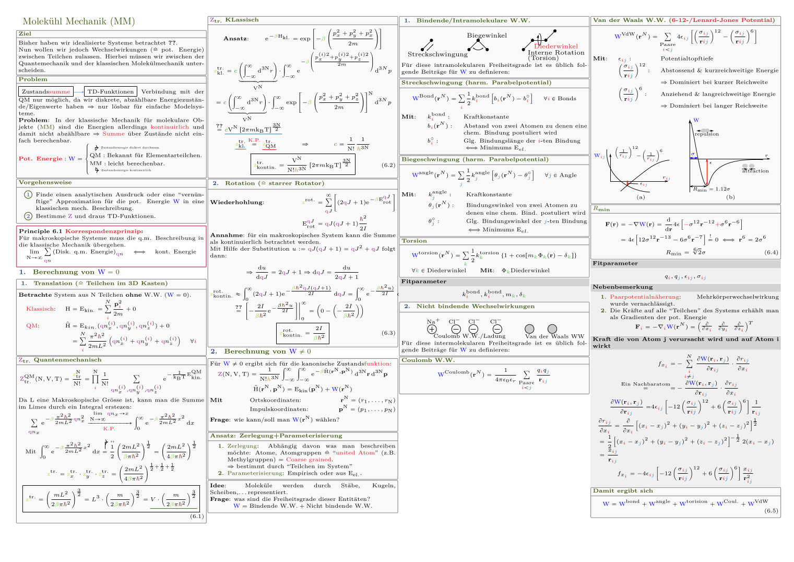

# Statistical Physics & Computer Science Formulary

This repository contains a LaTeX summary for the "Statistical Physics & Computer Science" formulary. The content of this formulary is based on the principles and applications of statistical mechanics and equilibrium molecular dynamics, Monte Carlo simulation, and stochastic dynamics, as presented in an undergraduate course at ETH Zurich.

If you find this formulary helpful, I would appreciate it if you could consider giving it a star ⭐ on GitHub. Your support encourages me to continue creating educational content.

## Course Overview

- **Abstract:** This formulary explores the principles and applications of statistical mechanics and equilibrium molecular dynamics, including topics such as Lagrange and Newton mechanics, phenomenological thermodynamics, and statistical thermodynamics. 
Exercises involve using a molecular dynamics simulation program to generate ensembles and calculate ensemble averages.

- **Objective:** 
The objective of this course is to provide an introduction to statistical mechanics with the aid of computer simulation. Students will develop skills to carry out statistical mechanical calculations using computers and interpret the results.

- **Content:**
  - Principles and applications of statistical mechanics and equilibrium molecular dynamics.
  - Monte Carlo simulation and stochastic dynamics.
  - Exercises using a molecular dynamics simulation program to generate ensembles and subsequently calculate ensemble averages.

## Table of Contents

### 1. Newton Mechanics
- Newtonian mechanics fundamentals.
  
### 2. Lagrange Mechanics
  - Lagrangian equations of motion.
  - Hamiltonian principles.
  - Lagrange multiplier method.

### 3. Phenomenological Thermodynamics
- Introduction to phenomenological thermodynamics.

### 4. Statistical Thermodynamics
- Boltzmann statistics.
- Maxwell-Boltzmann distribution.
- Microcanonical, canonical, and grand canonical ensembles.

### 5. Statistical Thermodynamics for Gases
- Molecular partition function.

### 6. Molecular Mechanics (MM)
- Introduction to molecular mechanics.

### 7. Molecular Dynamics (MD)
- Overview of molecular dynamics.

### 8. Stochastic Molecular Dynamics
- Introduction to stochastic molecular dynamics.

### 9. Types of System Properties
- System properties and their classification.

## How to Use This Formulary

This formulary is organized by topics, making it easy to navigate and find information quickly. Each section corresponds to a specific aspect of statistical physics and computer science.
Whether you are a student or a researcher, this formulary aims to be a valuable resource.

If you come across any errors or have suggestions for improvements, please don't hesitate to open an issue or submit a pull request. Your feedback is highly appreciated!

For any questions or clarifications, feel free to [contact me](mailto:pollakgeorg@gmail.com).

Happy Studying!
